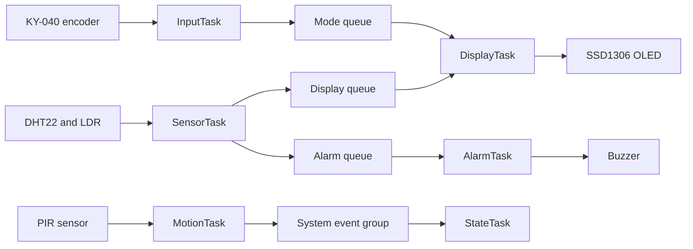
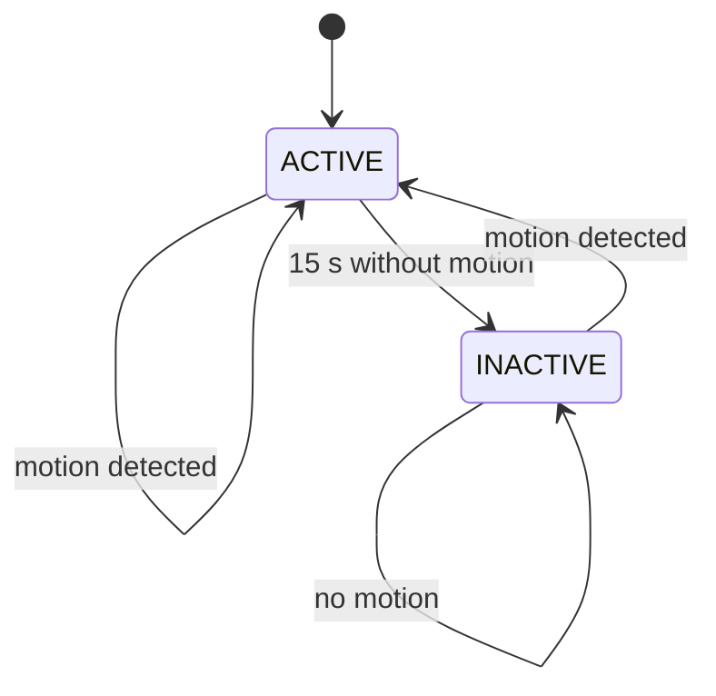

# BCA182 FreeRTOS Multisensor Room Monitor

## Project Overview

This project is a simulated room-monitoring device built for the BCA182
Embedded Systems Programming laboratory. It runs on an STM32F103C8 Blue Pill
using STM32Cube, native FreeRTOS APIs, and Wokwi. The system reads room data,
shows one measurement at a time on an OLED, watches for motion, and sounds a
buzzer when the temperature leaves the normal range.

The firmware is deliberately split into small task and logic modules. Each
module has one job, which makes the system easier to test and easier to explain
during the technical checkoff.

## Features

- Periodic environmental sampling every 2 seconds
- Relative light level reported from 0% to 100%
- OLED pages for temperature, humidity, light, and motion
- KY-040 rotary encoder navigation with wraparound
- Temperature alarm below 18 C or above 30 C
- PIR-based ACTIVE and INACTIVE behavior
- 15-second inactivity timeout
- FreeRTOS queues, event groups, mutex protection, and task priorities
- Native Unity tests for alarm, navigation, and state decisions
- Wokwi-ready STM32 circuit with no Arduino framework

## Learning Objectives

The project demonstrates how a small embedded application can be divided into
cooperating FreeRTOS tasks. It also shows why periodic tasks use
`vTaskDelayUntil()`, why queues are safer than unsynchronized shared values,
and how a mutex protects a shared serial peripheral.

## System Architecture



The OLED is owned by `DisplayTask`; no other task writes to it. SensorTask
publishes the same reading to separate display and alarm queues because a
FreeRTOS queue item is removed by the task that receives it.

## FreeRTOS Architecture

| Task | Priority | Main responsibility | Blocking behavior |
| --- | ---: | --- | --- |
| `InputTask` | 3 | Decode the rotary encoder | 5 ms periodic delay |
| `MotionTask` | 3 | Sample the PIR and update `EVENT_MOTION` | 100 ms periodic delay |
| `SensorTask` | 2 | Read environmental inputs and publish `SensorData` | 2 s periodic delay |
| `AlarmTask` | 2 | Evaluate temperature and control the buzzer | Queue wait with state recheck |
| `StateTask` | 2 | Manage ACTIVE and INACTIVE transitions | Event wait with 15 s timeout |
| `DisplayTask` | 1 | Render the selected OLED page | Sensor queue wait |

The higher priority of the encoder and PIR tasks keeps short-lived input events
responsive. DisplayTask stays at the lowest priority because a human can accept
a small display delay, while sensing and motion handling should not wait behind
a long OLED transfer.

## Hardware / Simulated Components

| Component | Purpose |
| --- | --- |
| STM32 Blue Pill | Main controller |
| DHT22 | Temperature and humidity input |
| Photoresistor module | Relative ambient light input |
| PIR motion sensor | Motion detection |
| KY-040 rotary encoder | OLED page selection |
| SSD1306 OLED | User display |
| Buzzer | Temperature alarm output |

## Pin Configuration

| Pin | Connection |
| --- | --- |
| PA0 | LDR analog output |
| PA1 | DHT22 data line |
| PA2 | PIR output |
| PA3 | Encoder CLK |
| PA4 | Encoder DT |
| PA5 | Encoder switch |
| PA8 | Buzzer, TIM1 channel 1 PWM |
| PA9 | USART1 transmit |
| PA10 | USART1 receive |
| PB6 | OLED SCL |
| PB7 | OLED SDA |

## Task Design

`SensorTask` samples the inputs on a fixed two-second schedule. `InputTask` and
`MotionTask` use shorter fixed schedules because encoder and PIR changes need
faster response. `AlarmTask` consumes sensor readings and treats exactly 18 C
and exactly 30 C as normal. `StateTask` starts the system ACTIVE, enters
INACTIVE after 15 seconds without motion, and returns to ACTIVE when motion is
detected. `DisplayTask` is the only task that updates the OLED.

## Inter-Task Communication

- `xQueueSensorToDisplay` carries `SensorData` to the OLED task.
- `xQueueSensorToAlarm` carries `SensorData` to the alarm task.
- `xQueueInputToDisplay` carries the selected `DisplayMode`.
- `xSystemEvents` contains `EVENT_ACTIVE`, `EVENT_MOTION`, and `EVENT_ALARM`.
- `serialMutex` protects USART1 while task diagnostics are transmitted.

The mutex is named `serialMutex` in this codebase (not `xSerialMutex`). The
sensor-to-display and sensor-to-alarm queues each hold five `SensorData` items;
the mode queue holds four `DisplayMode` items. `MotionTask` sets/clears
`EVENT_MOTION`, `StateTask` owns `EVENT_ACTIVE`, and `AlarmTask` owns
`EVENT_ALARM`.

## State Machine



While ACTIVE, the OLED, encoder, sensor sampling, and alarm operate normally.
While INACTIVE, the OLED is blanked, sensor sampling and encoder navigation are
paused, and the PIR remains active so the system can wake up.

## Repository Structure

```text
include/    Module headers and FreeRTOS configuration
src/        STM32 application, drivers, tasks, and pure logic
test/       Native Unity tests
docs/       Architecture, verification, analysis, and development records
diagram.json Wokwi circuit definition
wokwi.toml  Wokwi firmware and ELF paths
platformio.ini PlatformIO environments
```

## Getting Started

Install PlatformIO and the Wokwi extension for VS Code, then open this project
folder. PlatformIO downloads the embedded dependencies during the first build.
The native test toolchain is stored under `E:\PlatformIO` in this workspace so
the C: drive does not run out of space.

## Building the Project

```text
pio run
```

The default environment is `bluepill_f103c8`. The latest verified build passes
with approximately 50.2% of RAM and 51.9% of flash used.

## Running the Wokwi Simulation


Build first, then run **Wokwi: Start Simulator** from VS Code. Keep the Wokwi
Terminal open beside the circuit. The firmware reports a boot sequence similar
to this, although task startup order is scheduler-dependent:

```text
BCA182 FreeRTOS Multisensor
System starting...
ALARM: TIM1 clock 8000000 Hz, PSC=7, ARR=999 -> 1000 Hz PWM
SSD1306 address probe (0x3C): ACK (device found)
SSD1306 I2C errors during init: 0
DISPLAY: OLED initialised
SensorTask started
DisplayTask started
InputTask started
AlarmTask started
MotionTask started
StateTask started
Sample: Temperature: 25.40 C, Humidity: 61.20 %, Light: NN %, Motion: no
```

The DHT22 values shown above depend on the Wokwi sensor control. The light
percentage depends on the Wokwi photoresistor control.

![Wokwi simulation showing the connected Blue Pill, sensors, OLED, encoder, and buzzer]

## Unit Testing

Run the native tests with:

```text
pio test -e native
```

The 26 native tests cover five alarm cases, four navigation cases, three
encoder-edge cases, five DHT22 decode cases, four light-scaling cases, and
five state cases. The latest run passed all 26 tests (0 failed).
The unqualified `pio test` command selects the default STM32 environment and
fails because PlatformIO has no Unity configuration for `stm32cube`; use
`pio test -e native` for host tests. Latest native result: 26 passed, 0 failed.

## Static Code Analysis

Run:

```text
pio check -e bluepill_f103c8
pio check -e native
```

The firmware analysis reports no high- or medium-severity findings. The
remaining low-level findings are register-macro casts, the required HAL
callback signature, and one bounded-timeout diagnostic. Native analysis checks
the hardware-independent logic modules and reports no defects. Details are in
[`docs/static-analysis.md`](docs/static-analysis.md).

The exact `pio check` command analyzed the default `bluepill_f103c8` environment:
0 high, 0 medium, 20 low findings. Native cppcheck also passed with no defects.

| File / lines | Cause | Resolution |
| --- | --- | --- |
| `src/dht22.cpp`: 33, 39, 63, 69, 80-84, 87 | Casts reported through STM32 GPIO/DWT register macros | Accepted low-severity CMSIS register-access diagnostics |
| `src/dht22.cpp`: 39 | Unsigned timeout-bound diagnostic | Polling is bounded by both an iteration guard and elapsed DWT cycles |
| `src/main.cpp`: 41, 53-57, 66-67, 198 | Casts in FreeRTOS/CMSIS register macros and vector-table setup | Required framework/register patterns; retained |
| `src/main.cpp`: 150 | HAL callback parameter could be const | HAL callback signature is fixed by the framework; retained |

## Functional Verification

This traceability table uses the laboratory PDF's FT numbering and the symbols
present in this repository.

| Requirement | Implementation | Verification |
| --- | --- | --- |
| FR-01 Temperature | `SensorTask` (`src/sensors.cpp`), `DHT22_Read()` and `dht22Decode()` | FT-01 PASS; DHT22 decode native tests |
| FR-02 Humidity | `SensorTask` (`src/sensors.cpp`), `DHT22_Read()` and `dht22Decode()` | FT-02 PASS; DHT22 decode native tests |
| FR-03 Light | `SensorTask` and `lightPercentFromAdc()` (`src/sensors_logic.cpp`) | FT-03 PASS; light-scaling native tests |
| FR-04 Motion | `MotionTask` (`src/motion.cpp`) updates `EVENT_MOTION` | FT-08 PASS |
| FR-05 OLED | `DisplayTask` (`src/display.cpp`) owns SSD1306 and renders selected measurement | FT-01–FT-03 PASS |
| FR-06 Encoder navigation | `InputTask` uses `encoderStep()`, `nextDisplayMode()`, `previousDisplayMode()` | Navigation/encoder native tests; FT-04/FT-05 PASS |
| FR-07 Temperature alarm | `AlarmTask` (`src/alarm.cpp`) calls `evaluateTemperature()` | Alarm native tests; FT-06/FT-07 PASS |
| FR-08 Activity state | `StateTask` and `MotionTask` manage ACTIVE/MOTION state | State native tests; FT-08 PASS |
| FR-09 Automatic inactivity | `StateTask` uses `kInactivityTimeoutMs` (15,000 ms) | State timeout native test; FT-09 PASS |
| FR-10 Reactivation | Motion event returns `StateTask` to ACTIVE | State reactivation native test; FT-10 PASS |

All ten functional tests were manually exercised by the user in Wokwi and
reported PASS on 5 October 2026. The tested firmware SHA was not recorded.


)

| Test | Observed behavior | Result |
| --- | --- | --- |
| FT-01 | DHT22 set to 28.5 C; OLED updated to 28.5 C accurately | PASS |
| FT-02 | DHT22 set to 55.0% RH; OLED updated to 55.0% accurately | PASS |
| FT-03 | LDR varied from 10% to 90%; displayed relative light percentage tracked correctly | PASS |
| FT-04 | Clockwise encoder advanced Temperature → Humidity → Light → Motion | PASS |
| FT-05 | Counterclockwise encoder reversed page selection and wrapped correctly | PASS |
| FT-06 | At 32.0 C, AlarmTask activated the buzzer alert | PASS |
| FT-07 | At 24.0 C, the buzzer silenced and normal state returned | PASS |
| FT-08 | PIR trigger set the system to ACTIVE | PASS |
| FT-09 | After 15 seconds idle, system entered INACTIVE and blanked the OLED | PASS |
| FT-10 | PIR trigger while INACTIVE restored ACTIVE and the OLED | PASS |

The detailed procedure and observation record are in
[`docs/functional-verification.md`](docs/functional-verification.md). These
are user-reported Wokwi results; the exact tested firmware SHA was not saved.

## Engineering Decisions

- Separate queues are used for display and alarm consumers.
- The OLED has one owner, so it does not need a second task-level lock.
- The UART uses a mutex because several tasks write diagnostics.
- Pure alarm, navigation, and state decisions are separated so they can run in
	native tests.
- The custom FreeRTOS port is retained because it is needed for this Wokwi
	simulation setup.

## Limitations

- DHT22 acquisition uses the PA1 single-wire protocol with checksum
	validation; all DHT22, LDR, PIR, OLED navigation, alarm, timeout, and wake-up
	functional tests were reported PASS in Wokwi on 5 October 2026.
- The tested firmware SHA was not recorded with the Wokwi results; physical
	STM32 hardware testing and the separate FreeRTOS fault experiments remain
	outstanding.
- The Wokwi circuit is not a substitute for testing on physical STM32 hardware.
- The project does not claim calibrated light values; light is a relative
	percentage only.

## Future Improvements

- Add a finished-system screenshot to the repository’s documentation assets.
- Expand the native tests as new hardware-independent decisions are added.
